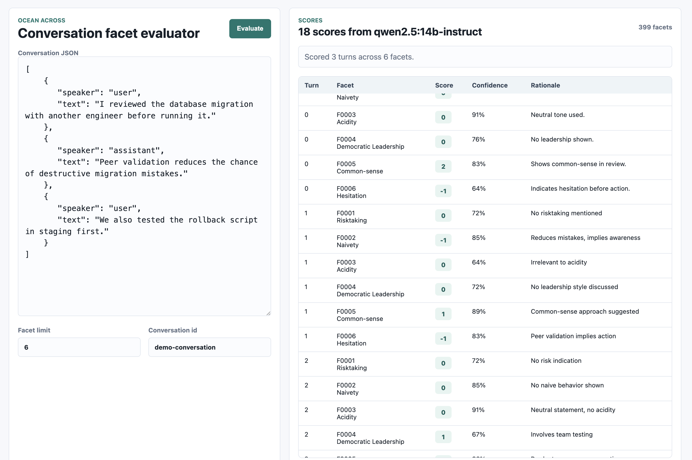

# Ocean Across Conversation Facet Benchmark

Lightweight Dockerized benchmark for scoring every conversation turn across hundreds or thousands of evaluation facets using an open-weights model served by Ollama.

The system has simple FastAPI backend, plain HTML/CSS/JS UI, Ollama model service, CSV-backed facet registry, and JSON result files saved under `data/results`.



## Installation And Setup

### 1. Start The Services

```bash
docker compose up --build
```

This starts two services:

| Service | Purpose |
| --- | --- |
| `app` | FastAPI backend and minimal web UI. |
| `ollama` | Local model server for open-weights inference. |

The app is available at:

```text
http://localhost:8000
```

### 2. Pull The Model

In another terminal:

```bash
docker compose exec ollama ollama pull qwen2.5:14b-instruct
```

The default model is `qwen2.5:14b-instruct`, which keeps the assignment within the open-weights and <=16B constraint. You can switch models with `OLLAMA_MODEL` in `docker-compose.yml`.

### 3. Process The Facets

Run facet categorization once after the model is available:

```bash
docker compose run --rm app python scripts/process_facets.py
```

This reads `data/processed/facets.csv`, asks Ollama to assign compact category labels, and writes the updated CSV back to the host machine through the Docker volume:

```yaml
./data:/app/data
```

The app automatically creates `data/processed/facets.csv` from `data/raw/facets_assignment.csv` if the processed file is missing.

### 4. Limit Category Count

By default, facet processing uses at most 12 categories:

```yaml
FACET_MAX_CATEGORIES: 12
```

To override it for one run:

```bash
docker compose run --rm -e FACET_MAX_CATEGORIES=8 app python scripts/process_facets.py
```

## How To Use The Application

### UI Flow

Open:

```text
http://localhost:8000
```

Then:

1. Paste a conversation as JSON in the left panel.
2. Set `Facet limit` for a quick run, or increase it to score more facets.
3. Set a `Conversation id`.
4. Click `Evaluate`.
5. Review per-turn, per-facet scores in the table.

If the page is refreshed while a run is still active, the UI restores the active run id from browser storage and keeps showing the running status until the backend marks it completed or failed.

Expected conversation format:

```json
[
  {
    "speaker": "user",
    "text": "I checked the logs and can explain the tradeoffs clearly."
  },
  {
    "speaker": "assistant",
    "text": "Let's verify the risky step before continuing."
  }
]
```

### API Flow

Start an evaluation run:

```bash
curl -X POST http://localhost:8000/api/evaluate \
  -H "Content-Type: application/json" \
  -d '{
    "conversation_id": "demo",
    "turns": [
      {"speaker": "user", "text": "I checked the logs and can explain the tradeoffs clearly."}
    ],
    "facet_ids": ["F0001", "F0002", "F0003"]
  }'
```

Omit `facet_ids` to score all facets.

The response includes a `run_id`. Poll that run until it is completed:

```bash
curl http://localhost:8000/api/evaluate/<run_id>
```

### Saved Results

Every evaluation run is saved automatically:

```text
data/results/<timestamp>_<conversation_id>.json
```

These files contain:

- Run id
- Conversation id
- Model name
- Input turns
- All facet scores
- Confidence values
- Rationales

Zip `data/results` manually when preparing the final submission artifact.

## Features

- Docker Compose setup with app and Ollama services.
- Open-weights local model inference through Ollama.
- Minimal UI for manual evaluation.
- API endpoint for programmatic evaluation.
- CSV-backed facet registry.
- Ollama-assisted facet categorization.
- Configurable maximum category count.
- Five ordered integer score scale: `-2, -1, 0, 1, 2`.
- Confidence output for every score.
- Short rationale for every score.
- Automatic result persistence as JSON.
- Refresh-safe running status through persisted run state.
- Batch-based scoring, so the architecture does not depend on one huge prompt.

## How It Works

### Data Flow

```text
raw facet CSV
  -> processed facet registry
  -> optional Ollama category labels
  -> conversation turns
  -> turn-by-turn facet batches
  -> Ollama JSON scoring
  -> normalized result records
  -> persisted run status
  -> saved JSON run file
```

### Facet Registry

`data/processed/facets.csv` has only the columns needed at runtime:

| Column | Purpose |
| --- | --- |
| `facet_id` | Stable id such as `F0001`. |
| `name` | Cleaned facet name. |
| `category` | Broad Ollama-generated category hint. |

Categories are hints, not hard-coded logic. If the facet list changes, rerun `scripts/process_facets.py`.

### Evaluation Loop

For each request, the app:

1. Loads facets from `data/processed/facets.csv`.
2. Selects requested facets or all facets.
3. Creates a `run_id` and writes a running status file.
4. Iterates through each conversation turn.
5. Splits facets into batches using `FACET_BATCH_SIZE`.
6. Sends each turn-plus-facet-batch to Ollama.
7. Parses JSON response.
8. Normalizes missing or invalid scores.
9. Saves the run to `data/results`.
10. Marks the persisted run status as completed or failed.

This satisfies the no one-shot prompt constraint because each model call scores only a manageable batch of facets for one turn.

## Scaling To 5000 Facets

The architecture scales by increasing the number of batches, not by changing the design.

The main work formula is:

```text
number_of_turns × ceil(number_of_facets / FACET_BATCH_SIZE)
```

Example with 5000 facets, 10 turns, and `FACET_BATCH_SIZE=8`:

```text
10 × ceil(5000 / 8) = 6250 Ollama calls
```

That is operationally heavy, but it does not require an architectural rewrite. The same code path works for 300 facets or 5000 facets.

## Parameter Tuning

| Variable | Default | Use |
| --- | --- | --- |
| `OLLAMA_MODEL` | `qwen2.5:14b-instruct` | Model used for categorization and scoring. |
| `FACET_BATCH_SIZE` | `8` | Number of facets scored per model call. |
| `EVALUATION_MAX_CONCURRENCY` | `4` | Maximum scoring batches the app runs at the same time. |
| `EVALUATION_RETRY_MISSING` | `true` | Retry facets omitted by the model in larger batches. |
| `EVALUATION_RETRY_BATCH_SIZE` | `1` | Facets per retry call when the model omits items. |
| `FACET_PROCESS_BATCH_SIZE` | `32` | Number of facets categorized per model call. |
| `FACET_MAX_CATEGORIES` | `12` | Maximum category labels generated during facet processing. |
| `OLLAMA_TIMEOUT_SECONDS` | `1200` | Timeout for one Ollama request. |
| `OLLAMA_NUM_CTX` | `4096` | Context window requested from Ollama. |
| `OLLAMA_NUM_PREDICT_PER_FACET` | `128` | Output-token budget multiplier per scored facet. |
| `OLLAMA_NUM_PARALLEL` | `4` | Number of parallel requests Ollama should process. |

`EVALUATION_MAX_CONCURRENCY` should usually be close to Ollama's `OLLAMA_NUM_PARALLEL`. If it is much higher, requests will queue or compete for memory instead of getting faster.

When changing Ollama server variables such as `OLLAMA_NUM_PARALLEL`, recreate the Ollama container so the server starts with the new setting:

```bash
docker compose up -d --force-recreate ollama app
```

The app uses real async HTTP requests through `aiohttp`, with the connection pool bounded by `EVALUATION_MAX_CONCURRENCY`, so this value directly controls how many batch requests it can keep in flight toward Ollama.

### Recommended Settings

For quick local demos:

```yaml
FACET_BATCH_SIZE: 8
EVALUATION_MAX_CONCURRENCY: 2
FACET_MAX_CATEGORIES: 8
```

For a 14B model on a 20GB GPU, start around:

```yaml
FACET_BATCH_SIZE: 8
EVALUATION_MAX_CONCURRENCY: 4
EVALUATION_RETRY_MISSING: true
EVALUATION_RETRY_BATCH_SIZE: 1
OLLAMA_NUM_PARALLEL: 4
OLLAMA_NUM_CTX: 4096
```

If memory is still available and latency improves, try:

```yaml
FACET_BATCH_SIZE: 12
EVALUATION_MAX_CONCURRENCY: 6
OLLAMA_NUM_PARALLEL: 6
```

For safer JSON reliability on weaker hardware:

```yaml
FACET_BATCH_SIZE: 4
EVALUATION_MAX_CONCURRENCY: 1
OLLAMA_TIMEOUT_SECONDS: 600
```

## What Limits Speed

The main bottleneck is local LLM generation. Every batch requires prompt processing and JSON generation.

Important limiting factors:

- Model size: larger models are slower.
- Hardware: CPU-only inference is much slower than GPU-backed Ollama.
- Facet batch size: larger batches reduce request count but increase prompt and output length.
- Missing facet retries: larger batches can make the model omit facets; the app retries omitted facets in small reliable batches.
- App concurrency: higher `EVALUATION_MAX_CONCURRENCY` can improve throughput if Ollama and hardware can handle it.
- Ollama server concurrency: `OLLAMA_NUM_PARALLEL` must be set on the Ollama service, not just the app.
- Job count: the app cannot fill a concurrency of 6 if a run only has 2-3 facet batches. Increase facet limit or reduce `FACET_BATCH_SIZE` for small runs.
- Conversation length: longer turns increase prompt tokens.
- Rationales: every rationale adds output tokens.
- Number of turns: each turn is scored independently.
- JSON reliability: very large batches increase malformed JSON risk.

## How To Improve Speed

Practical improvements:

- Increase `FACET_BATCH_SIZE` until omission retries become frequent, then back off slightly.
- Increase `EVALUATION_MAX_CONCURRENCY` up to the number of parallel Ollama requests your machine can handle.
- Match `OLLAMA_NUM_PARALLEL` to `EVALUATION_MAX_CONCURRENCY`, then recreate the Ollama container.
- Keep `EVALUATION_RETRY_MISSING=true` to avoid silent `0 / 25%` fallback scores when larger batches omit facets.
- Use GPU acceleration for Ollama.
- Use a smaller <=16B model if quality is acceptable.
- Reduce rationale length or make rationale optional for bulk scoring.
- Cache repeated `(turn, facet_id, model)` evaluations.
- For heavier production runs, move batch execution from in-process concurrency to a worker queue.
